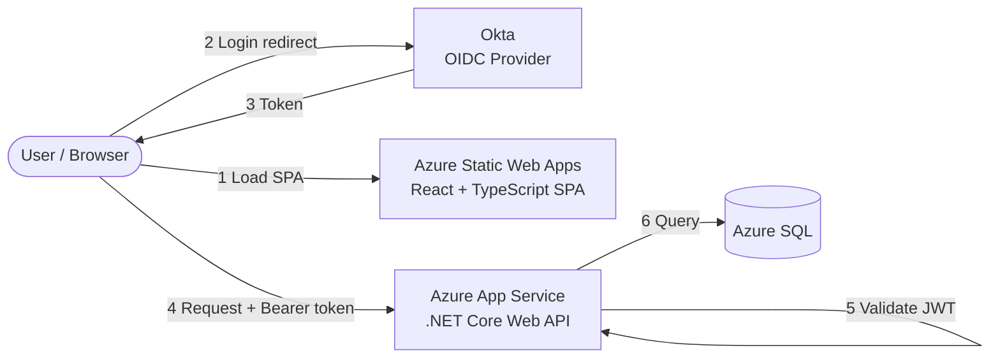

# Interview Dashboard

A small, full-stack dashboard application built as a portfolio / interview
piece. The emphasis is on backend engineering, clean tier separation, OIDC
authentication, and a high level of automated test coverage.

> **Status:** in active development.

## Overview

The application is a thin React dashboard backed by a .NET Core API and an Azure
SQL database. The design principle throughout is that **the API owns the
logic** — the frontend authenticates, fetches, and renders, while all business
rules, validation, and data access live server-side where they can be tested and
secured. The project also exists to demonstrate a disciplined approach to
**automated testing** and **CI/CD**, not just feature code.

## Architecture

Three independently deployable tiers:



**Request flow:** the browser loads the static SPA from Azure Static Web Apps,
the user authenticates against Okta via OIDC, and the SPA receives a token. Every
API call carries that token in an `Authorization: Bearer` header. The API
validates the JWT (issuer, audience, signature, expiry) on each request and
serves data from Azure SQL. The frontend never touches the database directly and
holds no secrets.

## Tech stack

| Tier      | Technology                                                        |
|-----------|-------------------------------------------------------------------|
| Frontend  | Vite, React, TypeScript, react-router, `@okta/okta-react`         |
| API       | .NET Core Web API (C#), JWT bearer authentication                 |
| Database  | SDK-style `Microsoft.Build.Sql` project (.sqlproj), Azure SQL     |
| Auth      | Okta (OIDC / OAuth 2.0)                                            |
| Hosting   | Azure Static Web Apps (frontend), Azure App Service (API)         |
| CI/CD     | GitHub Actions, path-filtered per tier                            |

## Repository structure

```
.
├── frontend/            # Vite + React + TypeScript SPA
├── api/                 # .NET Core Web API
├── database/            # Microsoft.Build.Sql project (DACPAC)
├── .github/workflows/   # Three path-filtered deployment workflows
├── CLAUDE.md            # Project context for AI-assisted development
└── README.md
```

## Authentication

Authentication uses the standard OIDC authorization-code flow via Okta:

1. The SPA redirects unauthenticated users to Okta to sign in.
2. Okta returns tokens to the SPA, which stores them and guards protected routes.
3. The SPA attaches the access token as a bearer token on every API request.
4. The API validates the token on each request and authorizes accordingly.

The API is **stateless** — it trusts only a valid, signed token, holds no session
state, and can scale horizontally without sticky sessions.

## Testing

Testing is a first-class goal: the aim is to verify behaviour automatically and
keep manual testing to a minimum. The suite follows a **test pyramid** — many
fast unit tests, fewer integration tests, a small number of end-to-end tests —
and runs in CI on every pull request.

- **Frontend:** Vitest + React Testing Library for unit/component tests, Mock
  Service Worker to stub API calls, and Playwright for critical-path end-to-end
  tests (login, protected route, dashboard render).
- **API:** xUnit with FluentAssertions and NSubstitute for unit tests;
  `WebApplicationFactory<T>` for in-memory integration tests through the real
  request pipeline; **Testcontainers** to run integration tests against a real
  SQL Server instance with the actual schema deployed.
- **Database:** tSQLt for in-database unit tests of stored procedures, functions,
  and constraints; the `Microsoft.Build.Sql` build itself validates the schema.

## Deployment

Each tier deploys independently via its own path-filtered GitHub Actions
workflow, so a change in one tier doesn't trigger the others.

- **Frontend** → Azure Static Web Apps (static hosting, globally distributed, no
  cold start).
- **API** → Azure App Service (Basic B1 with Always On, to avoid cold starts).
- **Database** → DACPAC published to Azure SQL.

**Ordering for coordinated releases:** additive changes deploy
**database → API → frontend**, so each tier is live only once the tier beneath it
supports it. Breaking changes use expand/contract across separate releases, with
destructive database cleanup deployed **last**. See `CLAUDE.md` for the full
rule.

## Local development

**Prerequisites:** Node.js 20+, the .NET SDK, access to a SQL Server instance
(local or container), and an Okta developer account for auth configuration.

```bash
# Frontend
cd frontend
npm install
npm run dev          # local dev server
npm run test         # Vitest

# API
cd api
dotnet run
dotnet test

# Database
cd database
dotnet build         # builds the DACPAC
```

## Design decisions

A few choices worth calling out, and why:

- **Logic in the API, thin frontend.** Keeps business rules testable and secure
  server-side, and keeps secrets and data access off the client.
- **Static frontend + separate API.** A static SPA on Azure Static Web Apps has
  no server to idle out, so the UI is always responsive; the API is hosted
  separately on a tier (B1 + Always On) that avoids cold starts. This split also
  mirrors a realistic production topology.
- **Monorepo with path-filtered pipelines.** Cross-tier features land as one
  atomic change and review, while each tier still deploys on its own when only it
  changes.
- **Stateless, JWT-validating API.** Standard OIDC, horizontally scalable, no
  session affinity required.
- **Real-database integration tests.** Testing against actual SQL Server via
  Testcontainers (rather than an in-memory substitute) catches schema and query
  issues that mocks hide.
- **Expand/contract deployment ordering.** Schema and contracts evolve without
  downtime by never leaving a tier depending on something not yet deployed.
